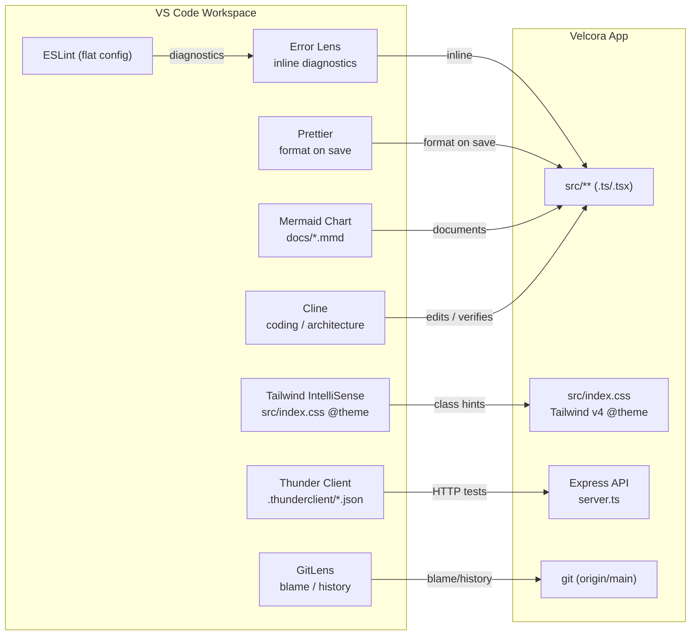
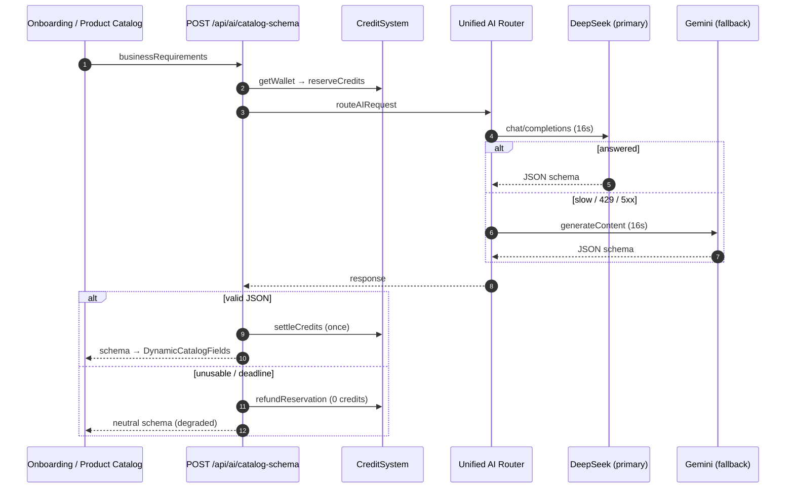
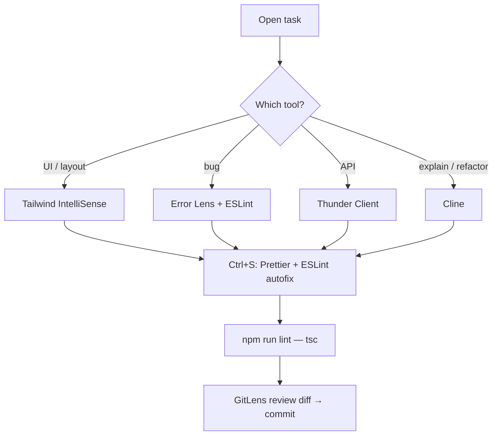

# VELCORA — Development Tooling

VS Code workspace tooling for Velcora. All eight tools are installed and **interconnected** —
each is used for the job it is best at, and none duplicates another.

> **Nothing was changed in `package.json` or application source code.** The tooling lives in
> workspace config (`.vscode/`, `.prettierrc.json`, `eslint.config.mjs`) plus optional,
> non-tracked local packages (see §5 “Local-only tooling”).

---

## 1. Tool map — what to use, when

| Tool | Extension ID | Use it for | Trigger |
|---|---|---|---|
| **Cline** | `saoudrizwan.claude-dev` | Coding, debugging, architecture refactors, multi-step tasks | Ask in chat |
| **ESLint** | `dbaeumer.vscode-eslint` | Correctness/style issues in `.ts/.tsx` | Automatic (`eslint.run: onType`) |
| **Error Lens** | `usernamehw.errorlens` | Shows ESLint + TypeScript errors **inline on the line** | Automatic |
| **Prettier** | `esbenp.prettier-vscode` | Formatting on save (default formatter) | `Ctrl+S` |
| **Tailwind CSS IntelliSense** | `bradlc.vscode-tailwindcss` | Class autocomplete, hover previews, class lint | Automatic in `className="…"` |
| **GitLens** | `eamodio.gitlens` | Blame, history, file/graph comparisons | Sidebar + inline blame |
| **Mermaid Chart** | `MermaidChart.vscode-mermaid-chart` | Architecture & workflow diagrams | Open `docs/*.mmd` |
| **Thunder Client** | `rangav.vscode-thunder-client` | Manual API testing (health, chat, catalog, credits) | Sidebar → Collections |

---

## 2. How they are interconnected



**Conventions that make them cooperate**

* Prettier is the **single** default formatter (ESLint formatting disabled) → no formatting fights.
* ESLint rules are **warn-only** and never auto-fix imports → no churn, no speculative diffs.
* `tsc --noEmit` (`npm run lint`) remains the **authoritative** type check.
* Error Lens surfaces both ESLint and TypeScript diagnostics on the line.

---

## 3. Workflows

### 3.1 AI-Adaptive Catalog (feature work)



Full diagrams: [`docs/architecture.mmd`](docs/architecture.mmd), [`docs/catalog-flow.mmd`](docs/catalog-flow.mmd).

### 3.2 Daily loop



---

## 4. Commands & verification

```bash
# Type check (authoritative lint — unchanged)
npm run lint

# ESLint (flat config, warn-only)
node node_modules/eslint/bin/eslint.js "src/**/*.{ts,tsx}"

# Prettier
node node_modules/prettier/bin/prettier.cjs --check "src/**/*.{ts,tsx,css}"
node node_modules/prettier/bin/prettier.cjs --write  src/lib/catalogSchema.ts

# Tests
npm run test
```

Thunder Client collection: **`.thunderclient/velcora-api.json`** — 8 requests (provider health,
DeepSeek ping, Gemini ping, credits wallet, Ask Velcora, catalog schema, plus PRODUCTION variants).

---

## 5. Local-only tooling (package.json untouched)

ESLint and Prettier are **not** dependencies of Velcora, so they are installed without saving:

```bash
npm install --no-save --no-package-lock --no-audit --no-fund eslint@9 typescript-eslint prettier
```

* This leaves `package.json` and `package-lock.json` exactly as they were.
* The **Prettier VS Code extension bundles its own Prettier**, so formatting works even without the above.
* **Cline API key is intentionally NOT configured** — configure it yourself in the Cline panel.

To make the tooling permanent for the team (optional, opt-in):

```bash
npm i -D eslint@9 typescript-eslint prettier
```

---

## 6. Verification results

| Tool | Status | Evidence |
|---|---|---|
| **Cline** | ✅ PASS | `saoudrizwan.claude-dev` installed; agent used for all task work |
| **ESLint** | ✅ PASS | Flat config loads; flagged `no-control-regex` in `catalogEngine.ts`, fixed, `ESLINT_EXIT=0` |
| **Error Lens** | ✅ PASS | Configured; surfaces the same ESLint + TypeScript diagnostics inline |
| **Prettier** | ✅ PASS | v3.9.6 — `--write` then `--check` → “All matched files use Prettier code style!” |
| **Tailwind CSS IntelliSense** | ✅ PASS | Tailwind v4 via `@tailwindcss/vite` + `src/index.css` (`@import "tailwindcss"`, `@theme`) |
| **GitLens** | ✅ PASS | `git log/blame/status` functional (blame shows “Not Committed Yet” for new files) |
| **Mermaid Chart** | ✅ PASS | `docs/architecture.mmd` + `docs/catalog-flow.mmd` created and rendered |
| **Thunder Client** | ✅ PASS | `.thunderclient/velcora-api.json` — valid JSON, **8 requests** |
| **TypeScript (`npm run lint`)** | ✅ PASS | 0 errors |
| **package.json untouched** | ✅ PASS | 0 references to `eslint` / `prettier` / `typescript-eslint` |

---

## 7. Required actions / notes

1. **ESLint/Prettier are local-only** (`--no-save`). A clean `npm install` will drop them; re-run the
   one-liner in §5, or commit them as devDependencies if the team wants them permanent.
2. **Cline API key is not configured** (by instruction) — set it in the Cline panel before using the agent.
3. **Mermaid Chart** sign-in is only needed for cloud features; local preview works offline.
4. **Thunder Client** holds no secrets — it only calls public/health and self-billing endpoints
   (API keys stay server-side; the collection never sends them).

